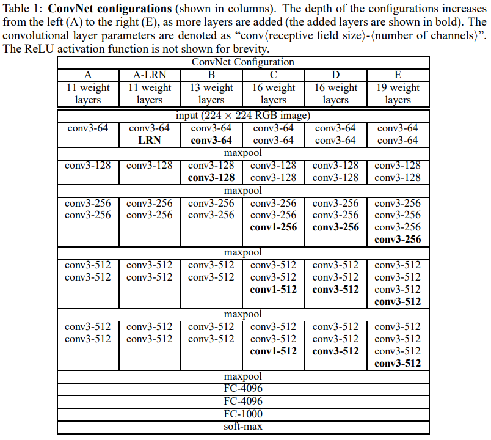
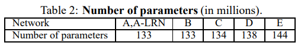
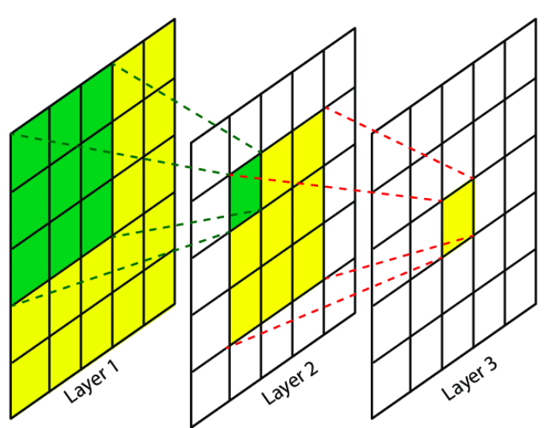
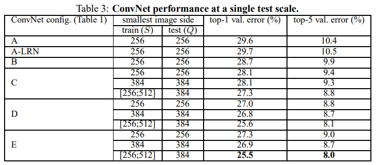

# VGGNet 구현해보기

- [VERY DEEP CONVOLUTIONAL NETWORKS FOR LARGE-SCALE IMAGE RECOGNITION](https://arxiv.org/pdf/1409.1556.pdf)

## 개요

VGGNet은 2014년 ILSVRC(ImageNet Large Scale Visual Recognition Challenge)의 Classification+Localization 분야에서 1, 2등을 했을 만큼 당시에 Classification 분야에서 좋은 성능을 낸 대표적인 모델 중 하나이다. VGG는 Visual Geometry Group의 약자로 연구팀 이름으로, VGG뒤의 숫자는 신경망 모델의 깊이(레이어 수)를 나타낸다.

## 모델의 구조

- Input : 224 x 224 RGB image
- 이미지 전처리 : train set의 RGB 평균값을 각 픽셀로 부터 계산하여 빼줌
- filter : 3 x 3, 1 x 1(input channel 에서 linear transformation 할 때)
- stride = 1, padding = same
- max-pooling : 2 x 2, stride = 2
- 3개의 FC Layer : 4096 → 4096 → 1000(classification, softmax)
- activation function : ReLU
- total 144M parameter(VGG-19)

## 모델의 구성

아래의 표 1에서 볼 수 있듯이, A-E라는 이름의 모델들을 11개의 layer(8 conv. + 3FC layers) 부터 최대 19개의 layer(16 conv. + 3FC layers)까지 모델의 깊이를 변화시켜가며 실험을 진행하였다.

VGGNet은 이전에 7x7의 filter를 사용하는 모델들과 달리 상하좌우의 feature를 추출할 수 있는 가장 작은 크기의 filter인 3x3을 사용하였다. filter의 크기를 줄이는 대신 layer를 늘려 7x7 filter와 동일한 receptive field를 갖도록 했다.

출처 : [Research Gate](https://www.researchgate.net/figure/The-receptive-field-of-each-convolution-layer-with-a-3-3-kernel-The-green-area-marks_fig4_316950618)

3x3 filter를 사용함으로써 얻는 이점은 다음과 같다.

1. 결정 함수의 비선형성 증가
7x7 filter를 사용했을 땐 activation function을 한 번 밖에 통과하지 않지만, 3x3 filter의 3개 layer를  사용했을 땐 activation function을 3번 통과하므로 함수의 비선형성이 증가하게 된다. 따라서 모델이 더 복잡한 특징도 추출할 수 있게 된다.
2. 학습 파라미터 수의 감소
7x7 filter를 사용한 C채널의 학습 파라미터 수는 $7^2C^2$로 총 $49C^2$이다. 그러나 3x3 filter를 사용한 3개 layer의 학습 파라미터 수는 $3(3^2C^2)$으로 총 $27C^2$이다. 7x7과 3x3의 3layer는 동일한 receptive field를 가지지만 parameter 수는 약 81% 감소했다. 따라서 학습시간에 있어서 더 유리하게 된다.

## 모델 학습

VGGNet은 다음과 같은 최적화 방법을 사용하여 모델을 학습시켰다.

- mini-batch gradient descent
- Momentum (0.9)
- batch_size = 256
- weight decay (L2 = 5e10-4)
- Dropout (0.5)
- Initial learning rate = 0.01
- 모델을 학습하면서 validation set accuracy가 증가하지 않을 때 learning rate를 1/10으로 감소시켰으며, 370K iterations (74 epochs)를 진행하는 동안 3번의 learning rate 감소가 이루어졌다.
- Initial weight는 $N(0, 0.01^2)$을 따르는 정규분포에서 sampling
- Initial bias = 0
- 고정된 224x224의 image를 얻기 위해 train image를 random하게 crop하거나 rescale하였고, 더 나아가 augmentation을 위해 random하게 수평으로 flip하거나 RGB color를 shift 하였다.

## 평가

1. local response normalization (A-LRN network)을 사용한 것은 큰 효과가 없었다. 따라서 더 깊은 레이어(B-E)에서 normalization을 사용하지 않았다.
2. ConvNet의 깊이가 증가함에 따라 classification error가 감소하는 것을 확인할 수 있었다. 해당 Dataset에서는 19개의 layer로도 error rate가 saturated 되었지만, 더 큰 Dataset에서는 더 깊은 layer가 유용할 수 있다.

## 결론

- ConvNet에서 layer의 깊이를 증가시키면 classification accuracy를 향상시키는 데 도움이 되며, ImageNet challenge dataset에 대한 state-of-the-art 성능을 얻을 수 있음을 증명하였다.

해당 모델을 코드로는 구현 해보았으나, 실제로 학습을 시켜보진 않았다. 150GB나 되는 ImageNet Dataset을 받아서 학습을 시킬 엄두가 나질 않았기 때문이다. ImageNet을 학습시키는 데 걸리는 시간은 P100 256개를 병렬로 연결해도 1시간이나 걸리는 것으로 알고 있는데, 단일 GPU를 사용하면 아마 몇 주 단위의 시간이 소요될 것이기 때문에 어쩔 수 없었다.

이 논문을 봤을 때, 딥러닝은 역시 컴퓨팅 파워가 중요하다고 생각했다. 과연 2014년 이전에는 deep network에 대한 인식이 없었을까? 물론 이전에도 deep network를 위한 시도는 있었으나 컴퓨팅 파워의 부족으로 ILSVRC의 dataset를 학습시킬 수 없었기 때문에 할 수 없었던 것으로 보인다. 분명 2021년인 지금도 엄청나게 깊은 deep network에 대한 시도는 계속 되고 있을 것이라고 생각한다. 다만 해당 network를 학습시킬 만한 컴퓨팅 파워가 부족하기 때문에 해당 network의 성능을 확인할 수 없을 뿐이라고 생각한다. 만약 딥러닝의 'deep'이 정말로 우리가 생각도 못할 만큼 'deep' 해야 한다면? 지금의 딥러닝 모델들이 이제 겨우 시작이라고 한다면?
